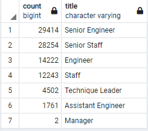
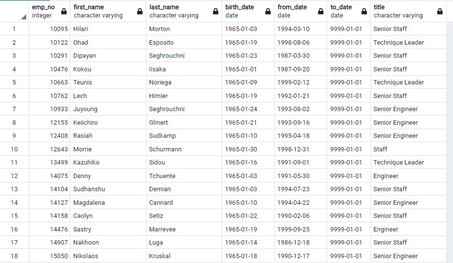

# Pewlett-Hackard-Analysis
Investigations in employee databases.

# Summary
This analysis is to aid Bobby's manager in looking for employees who are close to retiring. By discovering this trend early, management can take necessary action early and can prevent anything like this from occurring in the future. 

The purpose of this analysis is to find the following bits of information: 
1.  Determine the number of retiring employees by title.
To do this, we need to make a "Retirement Titles" table that holds all the titles of current employees who were born between January 1, 1952 and December 31, 1955. This
2. Identify employees who are eligible to participate in a mentorship program.
To do this, we made a "mentorship-eligibility" table that holds the current employees who were born between January 1, 1965 and December 31, 1965.

# Results
During or analysis, we came across the following findings:
- There are a startling number of senior staff members who would be at risk of leaving soon. Senior engineers and senior staff had 29,414 employees and 28,254 employees, respectively. Higher-up positions like this are much harder to replace, and require a lot more training to fill. 

- From the retiring titles, it can be seen that eligibile mentors would need to cover 90,398 employee positions (the sum of the table above).   
- For Eligible Employees who would fit the "mentorship" criteria, we discovered that a lot of the positions seem to be leaning in the "senior" positions as well. As seen on the below table: 
  
- However, counting the rows of the provided table, we find that there are only 1,549 of these "mentor" eligible employees, which would indicate that there may be a lot more retirees than in younger generations. 

# Summary

## The "Silver Tsunami"
Based on our analysis, there are 90,398 employee positions that would need to be filled to accommodate the soon-to-be retiring employees. From our analysis on mentorship eligibility, there were 1,549 eligible employees who could help train new hires. Since this many employees will be leaving and so few employees will be of "training eligibility", there is just not enough help to transition new employees into the company successfully. Pewlett-Hackard should consider giving greater incentives for employees of retiring ages who choose not to retire, or even consider outsourcing certain departments to contractors who are already experienced in certain areas, in order to prevent a gap in employee support. 

## Additional Tables
To aid in this analysis and to make a better informed decision by management, the following tables could be constructed:
- <b>Employee Transitions Table:</b> A table tracking the number of positions a single person has held. This may help identify people who are more capable of moving up in the company, which may mean that they are a fast learner. It is people like this who could also be suitable to mentoring new employees in the company. To do this, we could count the total titles per person in the "titles" table, and analyze our data from there.
- <b>Most strained Department Table:</b> To see what department in particular needs the most attention, we could find the eligible retirees and merge that with their department information. Once we know which department is most at risk in this "tsunami", then we can make management calls in how to better handle this (e.g. Outsourcing a division).